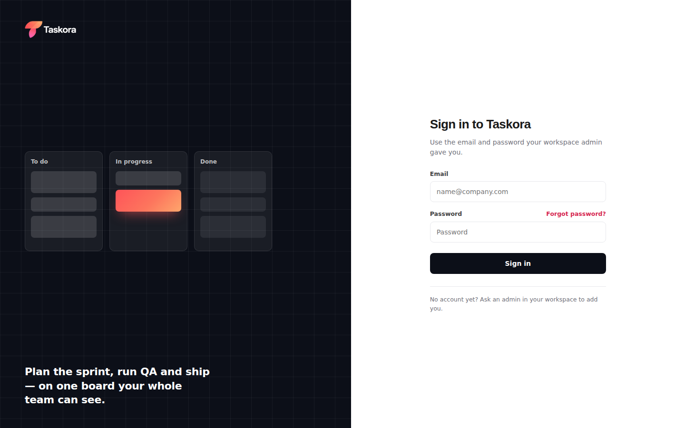

<p align="center">
  
</p>

Taskora is a project management tool for delivery teams: boards and workflows, epics, sprints, a QA and test-case tracker, deployment tracking, time logs and analytics, with per-person permissions down to individual fields.

It is a single HTML file on a single Supabase project. There is no build step and no framework, so you can host the front end anywhere that serves static files.



## Try it without a backend

Open `web/index.html` in a browser, or serve the folder:

```bash
cd web && python3 -m http.server 5500
```

With no `config.js`, Taskora runs as an offline demo that keeps everything in your browser's localStorage. It's useful for a quick look, but nothing is shared between browsers.

## Scrum: backlog, sprints and reports

- **Backlog:** tickets are ranked by drag and drop.
  - Drag a row, or select several with Shift or Cmd/Ctrl-click and drag them together.
  - Each ticket's menu can move it to a sprint, the top or bottom of the list, or back to the backlog.
  - Story points can be edited inline, and tickets can be created without leaving the list.
  - Quick filters: search, assignee, only my issues, recently updated, flagged, epic and type.
  - Side panels list epics (with progress) and versions.
- **Sprints:** create, rename, reorder, start, complete and delete sprints.
  - Starting a sprint sets its goal and duration (1–4 weeks or custom) and snapshots the commitment.
  - Completing a sprint moves open tickets to the backlog, a future sprint or a new sprint.
  - One active sprint per board by default; parallel sprints can be turned on in sprint settings.
- **Active sprint board:** columns follow the board's workflow, and cards drag between them within its transition rules.
  - Swimlanes by assignee or epic.
  - The header shows days left, the sprint goal and progress.
- **Reports:**
  - Burndown chart, with a guideline, non-working days and a full event log.
  - Velocity chart, showing commitment vs completed over the last 7 sprints.
  - Sprint report: completed, not completed, removed, and tickets added after the start (marked `*`).
- **Estimation:** story points, issue count or original estimate, switchable on every view.
- **Permissions** (Settings → Access & permissions):
  - View backlog, active sprint and reports.
  - Create, start and complete sprints.
  - Rank tickets.
  - Edit story points and a ticket's sprint.

  Managing sprints is also enforced in the database: owners, admins, or members an admin has granted it.

## How it's built

| Layer | What it uses |
|---|---|
| App | Vanilla HTML, CSS and JavaScript in `web/index.html` |
| Auth | Supabase Auth, email and password only; no public sign-up |
| Data | Postgres with row-level security; realtime updates between teammates |
| Admin actions | The `admin-users` Edge Function, the only path that can change roles, passwords or status |
| Files | Supabase Storage for profile photos |

```
taskora/
├── web/
│   ├── index.html              the app
│   ├── config.example.js       copy to config.js with your project URL + key
│   └── assets/                 logo, mark, favicon
├── supabase/
│   ├── migrations/             schema, policies, guards, RPCs
│   ├── functions/admin-users/  create members, change roles, reset passwords
│   └── config.toml
├── scripts/
│   ├── setup.sh                guided first-time setup and deploy
│   ├── deploy.sh               checks, then db / functions / web
│   └── deploy.env.example
└── docs/
```

## Roles

| Role | Can do |
|---|---|
| **Owner** | Everything, including managing admins and other owners |
| **Admin** | Workspace settings, boards, workflows, and managing members |
| **Member** | Tickets and time logs, plus whatever an admin grants under Settings → Access & permissions |

The database enforces these rules, not the page:

- Nobody can change their own role or status from the browser. Those columns have no update grant, and a trigger rejects the change even if a grant were added.
- Members can't grant themselves admin through their person record. A trigger pins every permission field, including on writes made through the `pm_patch_doc` RPC.
- Deactivating someone removes their access to every table and RPC immediately. It also bans their login.
- The workspace can never be left without an active owner.
- Only owners, admins, or members granted sprint management can create, start or complete sprints.

The migration ships with these behaviours tested. See [Security tests](#security-tests).

## Deploy in one go

Put `taskora.zip` and `deploy-taskora.sh` in the same folder (or leave the zip in Downloads), then:

```bash
bash deploy-taskora.sh
```

This unzips Taskora into `~/Developer/taskora` and runs `scripts/setup.sh`, which walks through:

1. Your Supabase project details.
2. Auth settings.
3. The database and Edge Function.
4. Your owner account.
5. Creating the GitHub repo.
6. Publishing to GitHub Pages, Netlify or your own server.

Re-run `bash scripts/setup.sh` from inside the repo at any time. The manual steps are below.

## Set it up

You need a Supabase account, Node.js 18+ (for `npx supabase`), and `curl`.

**1. Create the project.** In the [Supabase dashboard](https://supabase.com/dashboard), create a new project and keep the database password.

**2. Turn off public sign-ups.** Go to Authentication → Sign In / Providers and switch off *Allow new users to sign up*. Leave the Email provider on. This matters: the first account becomes the owner, and every account can read the workspace. The deploy script refuses to run while sign-ups are on.

**3. Configure the app.**

```bash
cp web/config.example.js web/config.js          # Project URL + publishable key
cp scripts/deploy.env.example scripts/deploy.env # project ref, DB password, hosting
```

The key in `config.js` must be the **publishable** key (`sb_publishable_…`) or the legacy anon key, never the secret one.

**4. Deploy the database and the function.**

```bash
npx supabase login          # once
./scripts/deploy.sh check   # nothing is shipped, only checked
./scripts/deploy.sh db
./scripts/deploy.sh functions
```

**5. Create your account.** In Supabase, go to Authentication → Users → *Add user*, enter your email and a password, and tick *Auto Confirm User*. As the first account, it becomes the **owner**. Sign in to the app, then add everyone else from **Members**.

**6. Publish the web app.**

```bash
./scripts/deploy.sh web
```

Set `TASKORA_WEB_TARGET` in `scripts/deploy.env` to choose where it goes:

- **`ec2`** rsyncs to a server over SSH, then optionally runs a post-deploy command.
- **`dir`** copies into a local folder.
- **`none`** builds `dist/` for Netlify, Vercel, Cloudflare Pages or GitHub Pages.

Finally, add the site's URL under Authentication → URL Configuration → *Site URL* so password-reset links come back to it.

## Adding people

**From the app (recommended).** Go to Members → *Add member*. Choose a role, then let Taskora generate a password or set one yourself. The credentials appear once so you can share them privately. By default they're asked to change the password after signing in.

**From Supabase.** Go to Authentication → Users → *Add user*. They join as a member, and an admin can change their role under Members.

Under Members, owners and admins can also:

- change a member's role
- reset a password
- deactivate or reactivate someone
- remove someone permanently

Tickets keep the names of people who have been removed.

## Everyday commands

```bash
./scripts/deploy.sh check                # checks only
./scripts/deploy.sh web                  # publish the front end
./scripts/deploy.sh all --push           # db + function + web, then commit and push
./scripts/deploy.sh web --yes            # no confirmation prompt (CI)
```

The pre-flight checks stop a deploy when:

- `config.js` is missing or holds a secret key
- the project ref doesn't match the URL
- a file has Windows line endings
- the JavaScript doesn't parse
- a key or env file is tracked by git
- public sign-ups are enabled

## Security tests

The migration was exercised against PostgreSQL 16 with stubs for Supabase's `auth` and `storage` schemas. The run checked:

- **Owner bootstrap:** the first account becomes owner, and roles come only from service-set metadata.
- **Self-promotion:** members and admins can't promote themselves through `profiles`, `people` or the RPC.
- **Other people's records:** members can't re-point or edit someone else's person record, and can't overwrite another person's avatar.
- **Admin-only structure:** statuses, boards and settings reject member writes. Worklogs require an existing task.
- **Deactivation:** a deactivated account can't read, write or call RPCs.
- **Owner safety:** the last owner can't be demoted or deleted.
- **Signed-out access:** the `anon` role has no access to anything.
- **Sprints:** members can't manage sprints unless granted, and can't borrow another person's permissions by creating a person record under their id.

## Troubleshooting

- **"This login has no Taskora profile."** The account was created before the migration ran. Re-add the person from Members, or insert their row into `public.profiles`.
- **Members page says "Request failed (404)".** The `admin-users` function isn't deployed. Run `./scripts/deploy.sh functions`.
- **Password reset emails don't arrive.** Supabase's built-in mailer is rate-limited. Add SMTP under Authentication → Emails, or reset passwords from Members instead.
- **Someone still sees the app after being deactivated.** Their login is banned at once, and every query is refused. The page itself signs them out on its next load.
